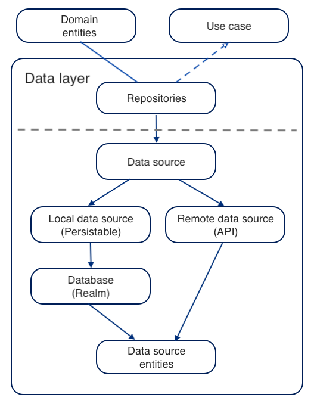

## Clean architecture with SwiftUI and Combine

A sample home run pizza client using Reactive Domain/repository. Combine is used for reactive programming.

### Build
Swift Package Manager is used for managing the distributions and dependencies. The Domain and its underlying  sub-modules are in a private Swift Package called Domain.

### Branches/Tags

- swiftUI: A Domain package for domain/repository based implementation of clean architecture using **Combine** + **SwiftUI**
- combine+clean: Domain package for domain/repository based implementation of clean architecture using **Combine** + **UIKit**
- rx+clean: Domain package for domain/repository based implementation of clean architecture using **RxSwift** + **UIKit**
- combine: **Combine** + **UIKit** based version. The Domain package implementation does not contain all the business logic but in the ViewModels there are a nice FPR implementation of the cart handling.

### Details
The **Domain layer** defines a communication interface between the UI and the Data layers. The communication interface consists of entity structures and use case protocols. Use cases define functions/operations on the entities.

The **Data layer** gives implementations to the use cases defined in the Domain layer. So the business logic is placed to the Data layer and is completely hidden from the UI layer. Since the Domain and Data layers are in a framework/package, they can be reused by different UI implementations, for example for iOS, macOS, tvOS, ...

In the **UI layer** the MVVM pattern is used to communicate with implementations in the Domain interface. The ViewModels are transforming the Domain entities to UI consumable data.

The repositories in the Data layer are implementing the use cases of the Domain layer. Repositories are using common data sources with Database and API compatible *Data source entities* and they present *Domain entities* to the UI layer.

